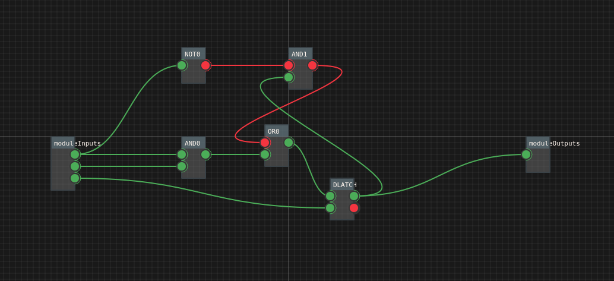
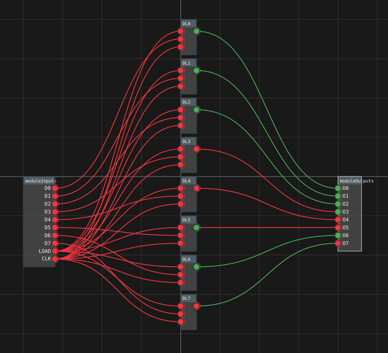
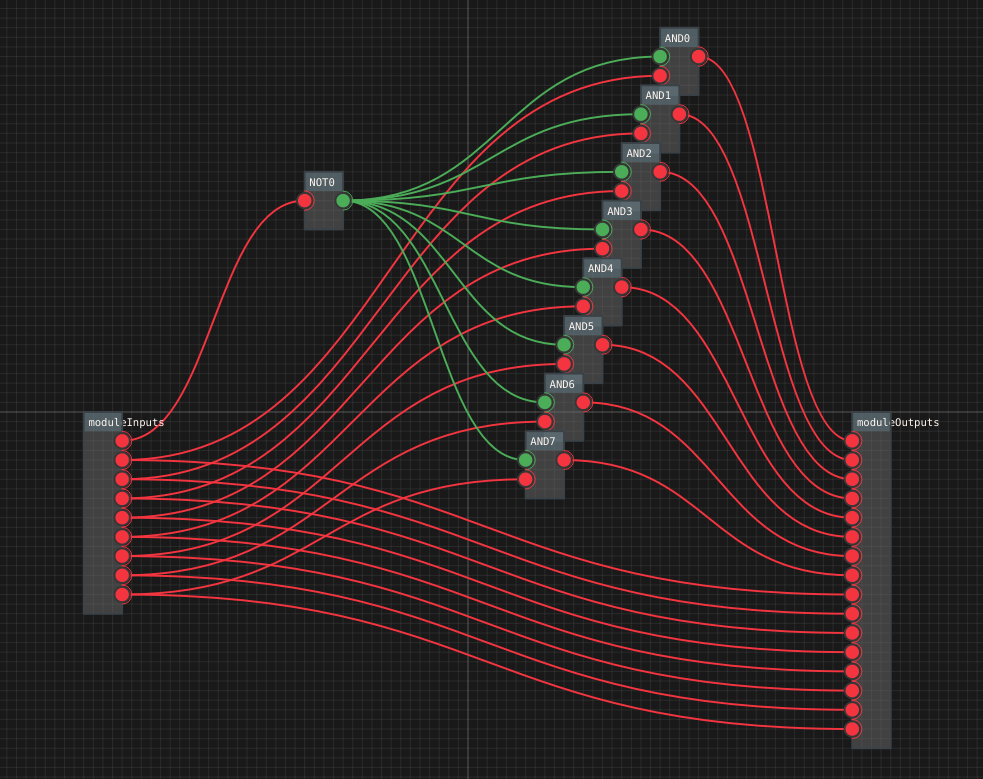
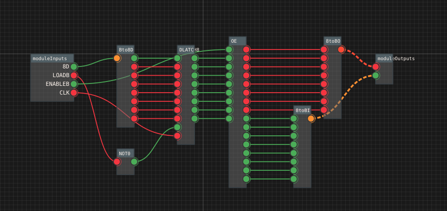

# Following Ben's build using simulation on q3sim

q3sim will be available in final form when it's implementation will be more complete

Currently there is available development version run as 

q3/q3/boostrap/boot.py (have to build some packages before - ie q3/q3c/build.sh)

Series of packages named cpu-* are different parts/elements of building Bens Eater 8bit computer from scratch 

Overview is here:
https://eater.net/8bit

## 1. State persistence - D-latch/flipflop

First I've built  a simple D-latch item:

[source](../q3/q3/bootstrap/tests/benSAP1/cpu_D_latch.py)

## 2. Registers - 1bit reg/8bit reg

Then I've prepared a package with 1bit register:

[source](../q3/q3/bootstrap/tests/benSAP1/cpu_D_latch_1bitreg.py)

... and 8-bit one:

[source](../q3/q3/bootstrap/tests/benSAP1/cpu_D_latch_8bitreg.py)

-- and then kind of general "output enabler" constructed with some AND gates:

[source](../q3/q3/bootstrap/tests/benSAP1/cpu_OE_8bit_ei.py)

with simple fromula based bits to byte mappers (to move to byte signal level)
Final 8bit register with buffered output:

[source](../q3/q3/bootstrap/tests/benSAP1/cpu_D_latch_8bitreg_ei.py)

## 3. ALU

Based on info from videos here

https://eater.net/8bit/alu

and Spaghetti-based version - prepared code-based one:

